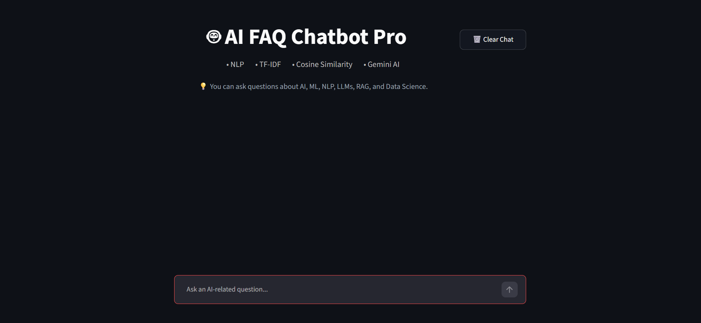
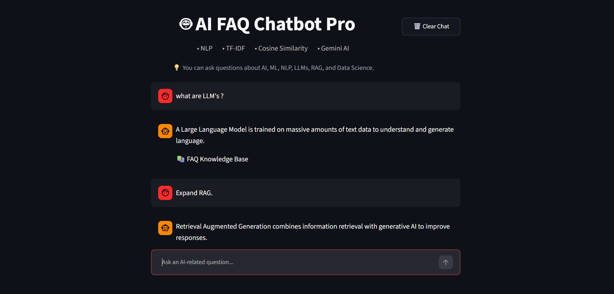
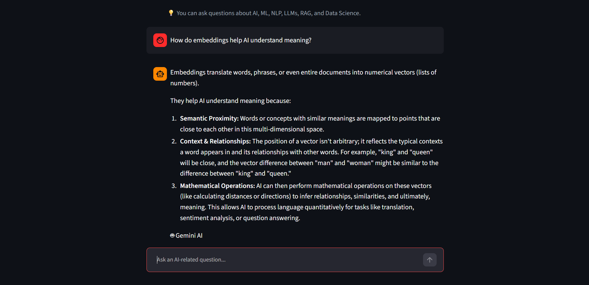
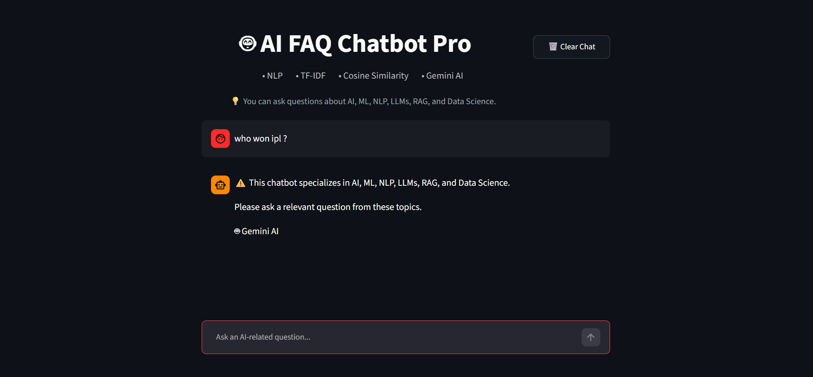

# 🤖 AI FAQ Chatbot Pro


An intelligent FAQ Chatbot built using NLP, TF-IDF Vectorization, Cosine Similarity, Streamlit, and Google Gemini AI.

This project was developed as part of the **CodeAlpha Artificial Intelligence Internship**.

---

## 🚀 Features

* AI-focused FAQ Knowledge Base (100+ FAQs)
* NLP Text Preprocessing
* Stopword Removal
* Porter Stemming
* Abbreviation Expansion
* TF-IDF Vectorization
* Cosine Similarity Matching
* N-Gram Based Retrieval
* Gemini AI Fallback Responses
* Conversation Memory
* Off-Topic Question Detection
* Streamlit Chat Interface
* Custom CSS Styling
* Environment Variable Support

---

## 🧠 Technologies Used

* Python
* Streamlit
* NLTK
* Scikit-learn
* Pandas
* Google Gemini API
* TF-IDF
* Cosine Similarity
* NLP

---

## 📂 Project Structure

```text
FAQ Chatbot/
│
├── app.py
├── requirements.txt
├── README.md
├── .env
├── .gitignore
│
├── data/
│   └── faqs.csv
│
└── styles/
    └── style.css
```

---

## ⚙️ Installation

### Clone Repository

```bash
git clone <your-repository-url>
cd FAQ-Chatbot
```

### Create Virtual Environment

```bash
python -m venv venv
```

### Activate Virtual Environment

Windows:

```bash
venv\Scripts\activate
```

### Install Dependencies

```bash
pip install -r requirements.txt
```

---

## 🔑 Environment Variables

Create a `.env` file in the project root.

```env
GEMINI_API_KEY=YOUR_API_KEY
```

---

## ▶️ Run Application

```bash
streamlit run app.py
```

---

## 📊 NLP Pipeline

1. User enters a question.
2. Text preprocessing is applied.
3. Abbreviations are expanded.
4. Stopwords are removed.
5. Stemming is performed.
6. TF-IDF vectors are generated.
7. Cosine similarity finds the best FAQ match.
8. If confidence is low, Gemini AI generates a response.
9. Off-topic questions are restricted.

---

## 🎯 Supported Topics

* Artificial Intelligence (AI)
* Machine Learning (ML)
* Deep Learning
* Natural Language Processing (NLP)
* Large Language Models (LLMs)
* Retrieval-Augmented Generation (RAG)
* Data Science
* Computer Vision
* Generative AI
* Prompt Engineering

---

## 📸 Sample Questions

* What is Artificial Intelligence?
* What is Machine Learning?
* Explain RAG.
* What is a Transformer Model?
* What is Prompt Engineering?
* What is an Embedding?
* What is Generative AI?

---

## 👨‍💻 Author

Harshith Reddy

B.Tech, Artificial Intelligence Student

Anurag University

---

## 📜 License

This project is developed for educational and internship purposes.


## 📸 Application Screenshots

<h3>1. Home</h3>


<h3>2. FAQ Response</h3>


<h3>3. Gemini Response</h3>


<h3>4. Off Topic Response</h3>

